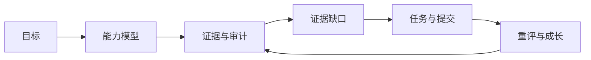

# Growth OS

用可追溯的证据理解当前能力，从证据缺口生成任务，再通过新证据验证成长。



## 本地演示

在项目根目录运行。使用现有项目 Python 环境和前端依赖；工程准备见 [演示说明](artifacts/m8/walkthrough.md)。

第一次执行种子命令，创建独立的受控 Demo。已有 Demo 数据时直接启动服务。

```powershell
.\.venv\Scripts\python.exe -m growth_os.demo
```

在一个终端启动只读后端：

```powershell
.\.venv\Scripts\python.exe -m uvicorn growth_os.api.local:create_local_app --factory --host 127.0.0.1 --port 8000
```

在另一个终端构建并启动前端：

```powershell
npm.cmd --prefix frontend run demo
```

打开 [本地 Demo](http://127.0.0.1:4173/)。材料与目标均为受控构造，不代表真实用户成果。页面展示已完成的旅程：RAG 实践 3 → Agent Evaluation 证据缺口 → 评测任务 → 提交 → 重评为 4。理解等级仍为 2，保留独立的理解证据缺口。

## 三个页面

能力与当前缺口：


等级的证据依据：


任务、提交与重评前后等级：


## 隔天回来

首页新增返回摘要，展示变化、下一步与已记录的学习偏好。使用独立的返回场景库，旧 Demo 可继续运行。

首次创建（已有 `data/demo-return` 时跳过）：

```powershell
.\.venv\Scripts\python.exe -m growth_os.demo --directory data/demo-return --with-return
```

后端启动前指定该库，前端启动命令与上面相同：

```powershell
$env:GROWTH_DEMO_DIRECTORY = (Resolve-Path data/demo-return).Path
.\.venv\Scripts\python.exe -m uvicorn growth_os.api.local:create_local_app --factory --host 127.0.0.1 --port 8000
```


日期通过注入模拟次日；材料和偏好均为受控构造。验证使用重新打开数据库的新进程，摘要从已持久化来源生成。工程记录见 [G6 验证](artifacts/gates/G6/README.md)。

## 当前验证状态

能力地图与三个页面改版完成；G6隔天返回在确定性只读范围内验证通过。452项本仓与111项上游测试通过，53项浏览器检查通过。报告见 [G6-c 验证](artifacts/gates/G6/g6c/README.md) 和 [前端改版验证](artifacts/frontend-redesign/README.md)。

当前仍为本地只读演示。上传、实时目标澄清、Mentor Chat与对外发布尚未交付。
