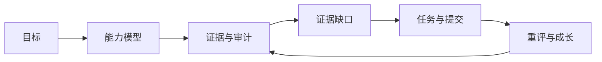
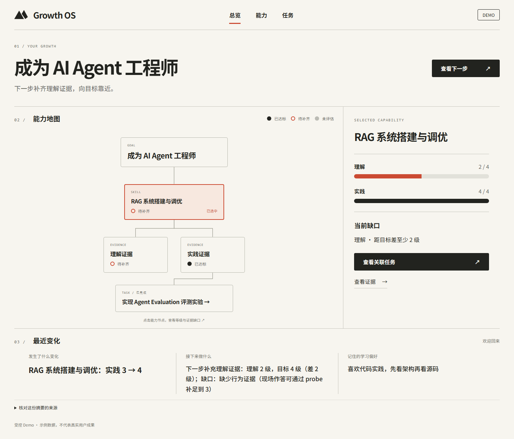
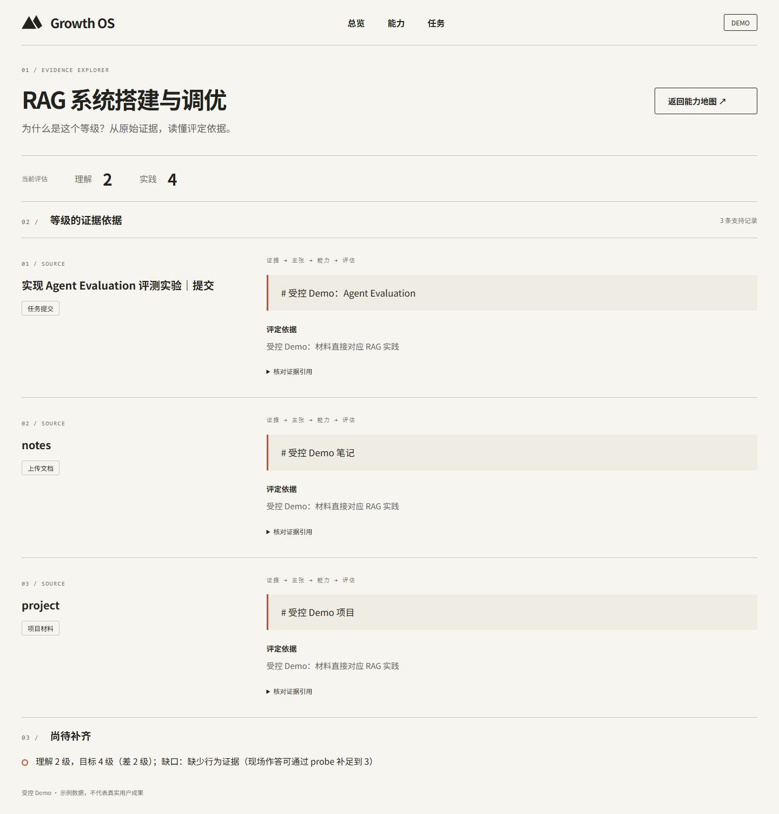
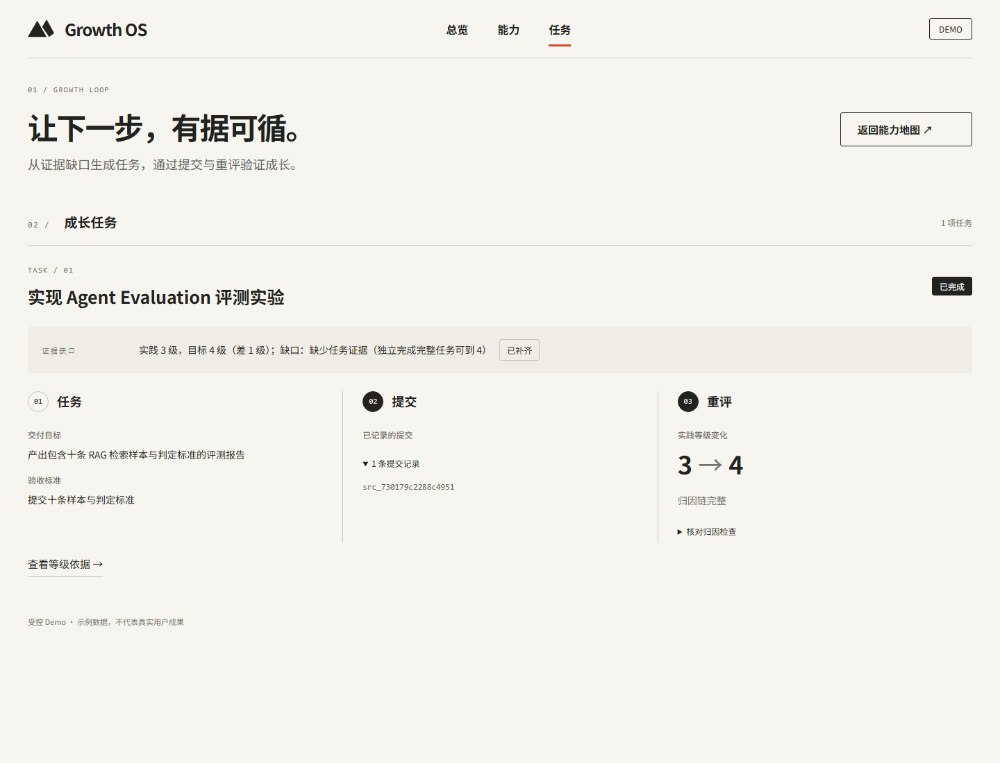

# Growth OS

用可追溯的证据理解当前能力，从证据缺口生成任务，再通过新证据验证成长。



## 正常使用（单用户本地）

已有项目依赖的情况下，在根目录运行：

```powershell
.\start-growth.ps1
```

打开 [Growth OS](http://127.0.0.1:5173/)。脚本等待后端就绪后启动前端，保留终端，Ctrl+C 停止。首次使用自动创建空的个人库 `data/product`，无需手工执行 Demo 种子。

默认读取根目录 `.env` 的现有模型配置，调用真实模型。目标澄清、能力树、任务生成、提交绑定和 AI 导师共用产品入口；导师读取目标、显式学习偏好、能力、证据和评定历史，连续对话保存在本机。模型请求失败会显示失败状态，可显式重试，不自动切换成演示答案。

无模型配置时先按 [.env.example](.env.example) 配置。要测试离线固定流程，显式运行 `.\start-growth.ps1 -Demo`，页面会标注离线演示。它仍使用个人目录；隔离测试可提前设置 `GROWTH_PRODUCT_DIRECTORY`。

当前已接通新用户目标→能力树→材料/任务→提交→证据与重评→导师对话；完整 MVP 尚未封板。已接通导师页显式确认任务、目标版本调整及能力目标要求调整；PDF/ZIP 页面、完整知识检索、GitHub OAuth与完整连续使用总验收仍在后续计划中。当前结果和下一阶段见 [产品体验实施计划](.project-to-act/docs/PRODUCT-EXPERIENCE-PLAN.md) 与 [验收记录](artifacts/product/README.md)。

## 本地演示

在项目根目录运行。使用现有项目 Python 环境和前端依赖；工程准备见 [演示说明](artifacts/m8/walkthrough.md)。

第一次执行种子命令，创建独立的受控 Demo。已有 Demo 数据时直接启动服务。

```powershell
.\.venv\Scripts\python.exe -m growth_os.demo
```

在一个终端启动只读后端：

```powershell
.\.venv\Scripts\python.exe -m uvicorn growth_os.api.local:create_local_app --factory --host 127.0.0.1 --port 8000
```

在另一个终端构建并启动前端：

```powershell
npm.cmd --prefix frontend run demo
```

打开 [本地 Demo](http://127.0.0.1:4173/)。材料与目标均为受控构造，不代表真实用户成果。页面展示已完成的旅程：RAG 实践 3 → Agent Evaluation 证据缺口 → 评测任务 → 提交 → 重评为 4。理解等级仍为 2，保留独立的理解证据缺口。

## 三个页面

能力与当前缺口：



等级的证据依据：



任务、提交与重评前后等级：



## 隔天回来

首页新增返回摘要，展示变化、下一步与已记录的学习偏好。使用独立的返回场景库，旧 Demo 可继续运行。

首次创建（已有 `data/demo-return` 时跳过）：

```powershell
.\.venv\Scripts\python.exe -m growth_os.demo --directory data/demo-return --with-return
```

后端启动前指定该库，前端启动命令与上面相同：

```powershell
$env:GROWTH_DEMO_DIRECTORY = (Resolve-Path data/demo-return).Path
.\.venv\Scripts\python.exe -m uvicorn growth_os.api.local:create_local_app --factory --host 127.0.0.1 --port 8000
```


日期通过注入模拟次日；材料和偏好均为受控构造。验证使用重新打开数据库的新进程，摘要从已持久化来源生成。工程记录见 [G6 验证](artifacts/gates/G6/README.md)。

## 当前验证状态

Evidence页面已补齐攻击复核、反向证据、排除项和规则局限，详见 [审计详情验证](artifacts/evidence-review/README.md)。全部为已记录结果的只读展示。

目标澄清与确认现有独立本地入口，支持输入四要素、显式确认与刷新后继续；默认固定问句，尚未验证真实模型效果。见 [首次使用验证](artifacts/onboarding/README.md)。

能力地图与三个页面改版完成；G6隔天返回在确定性只读范围内验证通过。452项本仓与111项上游测试通过，53项浏览器检查通过。报告见 [G6-c 验证](artifacts/gates/G6/g6c/README.md) 和 [前端改版验证](artifacts/frontend-redesign/README.md)。

原演示服务保持只读；任务交互和目标澄清使用下方独立实验服务。通用材料上传、能力生成页面联动、Mentor Chat与对外发布尚未交付。

2026-10-06：下方独立任务交互实验已完成I1–I5受控范围验证，26项总判定、478项本仓及111项上游完整回归通过。任务文件上传已交付；通用材料上传、真实模型交互验收、Mentor Chat和发布仍开放。最终阶段报告见 [I5验收](artifacts/interaction/i5/README.md)。

## 任务交互实验（I1–I4）

2026-10-06 新增独立任务交互库，支持开始、标记受阻、恢复、放弃，以及理解回答和实践文件提交与重评。文档支持 Markdown/TXT，代码支持既有源码格式，归档支持 ZIP，单文件最多 2 MB。

首次创建实验库，再启动交互后端（替代当前端口8000上的只读后端）：

```powershell
.\.venv\Scripts\python.exe -m growth_os.api.interactive
.\.venv\Scripts\python.exe -m uvicorn growth_os.api.interactive:create_local_interactive_app --factory --host 127.0.0.1 --port 8000
```

前端仍使用 `npm.cmd --prefix frontend run demo`。进入成长任务页，新增的理解任务可操作；受阻和放弃需填写原因。实验库保存在 `data/interactive`，重复创建会拒绝覆盖。原只读后端不显示操作按钮。实施边界见 [交互计划](.project-to-act/docs/INTERACTION-PLAN.md)。

开始理解任务后填写回答，点击“提交并重评”。默认绑定使用固定规则、零外部模型请求，不能用演示等级评价回答质量。真实模型模式需在启动前显式设置 `GROWTH_INTERACTION_REAL_MODEL=1`，本轮未执行该模式。只运行一个交互服务进程。完成结果刷新与重启后仍可读；进程中断留下的提交会拒绝重跑，需核对证据后恢复，避免无依据地重复评定。

已有实验中的实践任务已完成时，可创建一个全新场景，保留原实验库：

```powershell
.\.venv\Scripts\python.exe -m growth_os.api.interactive --directory data/interactive-files --with-practice
$env:GROWTH_INTERACTION_DIRECTORY = (Resolve-Path data/interactive-files).Path
.\.venv\Scripts\python.exe -m uvicorn growth_os.api.interactive:create_local_interactive_app --factory --host 127.0.0.1 --port 8000
```

开始实践任务后选择符合交付物类型的文件，点击“提交文件并重评”。文档和代码须为 UTF-8；上传接口接收文件内容，存储路径由服务器生成。同一请求重放不会再次执行闭环，失败后可手动重试。文件不会作为程序执行。场景初始实践3、理解2，受控文件提交后实践4、理解仍2；这验证的是证据链机制。

## 首次使用实验（O1–O3）

首次创建独立目标实验库，再启动目标服务（替代端口8000上的其他后端）：

```powershell
.\.venv\Scripts\python.exe -m growth_os.api.onboarding
.\.venv\Scripts\python.exe -m uvicorn growth_os.api.onboarding:create_local_onboarding_app --factory --host 127.0.0.1 --port 8000
```

前端仍运行 `npm.cmd --prefix frontend run demo`，打开 [目标入口](http://127.0.0.1:4173/start)。填写目标与四要素，再填写确认原话、点击“确认目标”。随后可点击“生成结构演示模板”，查看三层树、未校验来源与未知当前等级。模板尚未核对目标相关性，目标等级仅为占位值；默认固定问句与模板，不调用外部模型。模型模式需显式配置 `GROWTH_ONBOARDING_REAL_MODEL=1`，生成结果仍未校验。

地址栏保留实际目标ID，刷新可直接恢复；失败提问可手动恢复，已生成能力树不会因重复请求再次生成。已有 `data/onboarding` 时直接启动服务，播种命令不会覆盖原库。

能力点提供“生成理解任务”“生成实践任务”：先检查证据与缺口，再提议任务；重复请求复用未结束任务。进入本目标任务页后显式开始，可提交理解回答或UTF-8 Markdown产物，再查看原文、评级依据与归因。默认固定任务与绑定规则只验证链路，不验收产物质量；任务完成不保证等级提升。任务、证据和能力树链接始终保留实际目标上下文。O3验证见 `artifacts/onboarding/o3/README.md`。

能力树下方新增“导入已有个人材料”：选择UTF-8 Markdown、TXT或代码（最多2 MB），选择材料类型、归属声明和相关能力点，再点击“上传并预览绑定”。预览会显示原文与定位，尚不改变绑定或评级；核对后点击“确认绑定并重评”。未知归属可保存但不能通过绑定闸门。绑定后重评失败可单独恢复，刷新和重启可读回材料状态。候选仅记录你的选择，不冒充模型判断；真实材料质量与模型效果尚未验收。P1验证见 `artifacts/personal-materials/README.md`；PDF/ZIP直接导入将在下一步接入。
